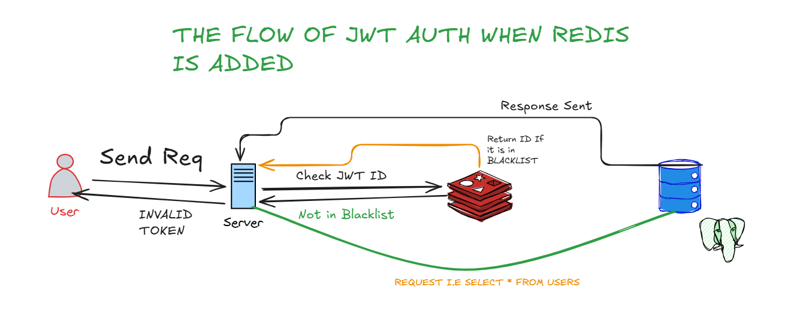
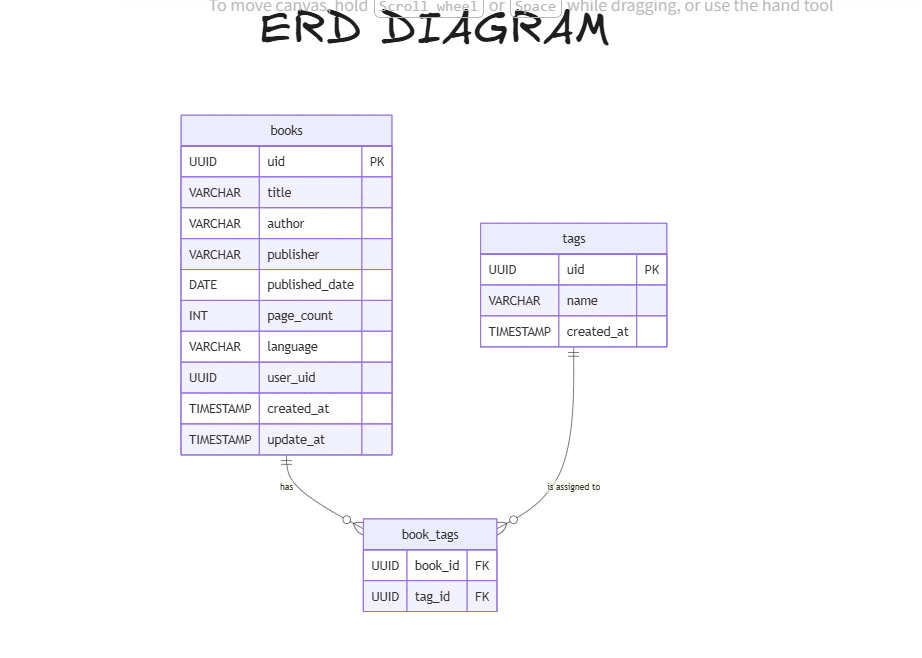

# Fast Api

FastAPI is a modern, high-performance Python web framework designed specifically for building APIs quickly and efficiently. It is a backend framework that leverages standard Python type hints to automatically validate data, serialize responses, and generate interactive API documentation. 

## Setup 

- Create a python Virtual Enviroment and activate it

```python3 []
python -m venv venv

./venv/Scripts/activate

```
- Then install fastapi

```
pip install fastapi[standard]
```
---
## Creating a Fastapi route

```
from fastapi import FastApi

app=FastApi()

@app.get("/")
async def greet():
    return {"msg":"Hello world"}

```
## Working With dynamic URLS

To work with dynamic urls you have to pass the variable in the route enclosed in curly braces when you enter any name after the route the name will be displayed 

```
@app.get("/greet/{name}")
async def greet_name(name:str)->dict:
    return {"greeting":f"Hello, {name}!"}
```

## Query parameters

When you dont pass the variable in url and define in a function then fastapi will treat it as query parameter and in route you have to give a `?` before writing a variable name

The purpose of query parameters is for main is filtering the data you can also set the default values of it 

```
@app.get("/greet_me")
async def greet_me(name:str)->dict:
    return {"greeting":f"Hello, {name}!"}
```

Now when calling this route this will be like 

```
http://localhost:8000/greet_me?name=Tabarak

```

## Creating A RESTAPI

- In fastApi we create RESTAPI using @app.get , post , patch and delete and we perform it first by storing the list of dictionary in our `books.py` file.


- To make our code more modular and managable we store different parts of program in different files such as we store the pydantic models in `schemas` file and api endpoints in `routes` file.
  
## Important Libraries used 

### Alembic 
A light weight database migration tool for python it keep track the changes in the table / model and update it without the need of droping the table

### Bcrypt
A library used to hash the passwords to store the user password securely

### Secrets 
The Python secrets module is a built-in standard library used for generating cryptographically strong random numbers. 

### Redis
Redis is used to create and store a blocklist JWT tokens id when a user logout that jwt id will be stored in a blocklits and every time a user make a request his jwt id will be checked if is it in a blocklist or not

---
## The Flow of The JWT Auth when Redis is used

## Role base Access Control

The app uses also the role base access control currently it has 2 roles `admin` and 
`user` the admin will have the following control

- Adding users
- change roles 
- crud on users 
- book submissions
- crud on reviews 
- revoking access

Similarly the users which will use the application will have the following control

- Crud on their own book submission
- crud on their reviews 
- crud on their accounts

## DataBase Realtionship
In this app i used to connect 2 tables `book` and `users` table by declaring the user id a FOREIGN KEY and add the functionality that we can retrive the id of the user who submitted the book



## Mail Sending Functionality
The bookly app also have the functionality
of sending mails for that i used the library
`redmail` to send email to users using that
we can verify the user and perform password resets also. There is another option fastapi mail but that require much code and setup so i prefer that

The Library i used can be installed here:

```
pip install redmail
```

## Clery 

To run clery run the following command

```bash
celery -A src.celerly.celery_app worker --pool=solo -l info -E
```

To more analyze the task sent or not i used the flower dashboard

```
pip install flower
```

then run in a new terminal

```
celery -A src.celerly.celery_app flower --address=0.0.0.0 --port=5555 --loglevel=info
```

- H